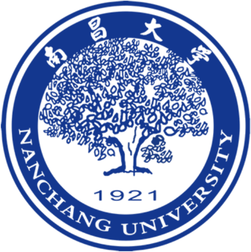

## About Me

I am Jiamin Chen (陈家民). I received my Ph.D. in Computer Science and Technology from Central South University (CSU) in June 2024.
During my doctoral studies, my research interests included graph neural architecture search (GNAS) acceleration methods, GNAS applications, and time series analysis.
I have published several papers in the following conferences and journals (SIGIR, CIKM, BIBM, TPDS, IS, TCBB, etc.).
My **[Github](https://github.com/AutoMachine0)** and **[Google Scholar](https://scholar.google.com/citations?user=5WbxPrIAAAAJ&hl=zh-CN)**.
I am looking for a suitable position in academia.
If you are interested in me, please feel free to contact me. 

<!--
I am Jiamin Chen (陈家民). I received my Ph.D. in Computer Science and Technology from Central South University (CSU) in June 2024. 
I received my M.S. and B.S. degree from Nanchang University (NCU). 
During my doctoral studies, my research interests included graph neural architecture search (GNAS) acceleration methods, GNAS applications, and time series analysis.
I have published several papers in the following conferences and journals (SIGIR, CIKM, BIBM, TPDS, IS, TCBB, etc.).
I am looking for a suitable position in academia.
If you are interested in me, please feel free to contact me. 
[My Github](https://github.com/AutoMachine0)
- **[My Google Scholar](https://scholar.google.com/citations?user=5WbxPrIAAAAJ&hl=zh-CN)**-->

## Research Interests

- **Large Language Model on Graph**
- **Graph Automatic Machine Learning**
- **Bioinformatics based on Graph Neural Networks**

## Experience
- &nbsp; &nbsp;**2010.09-2014.06 Nanchang University / Bachelor Degree** 
- &nbsp; &nbsp;**2014.09-2017.06 Nanchang University / Master Degree** 
- &nbsp; &nbsp;**2016.11-2017.02 iFLYTEK Research Institute / Intern-researcher** 
- &nbsp; &nbsp;**2017.06-2020.07 China Mobile Zhejiang Company / IT Engineer** 
- &nbsp; &nbsp;**2020.09-2024.06 Central South University / Doctoral Degree** 

<!--## News

- **[Feb. 2020]** Our paper about incremental learning is accepted to CVPR 2020.
- **[Feb. 2020]** We will host the ACM Multimedia Asia 2020 conference in Singapore!
- **[Sept. 2019]** Our paper about few-shot learning is accepted to NeurIPS 2019.
- **[Mar. 2019]** Our paper about few-shot learning is accepted to CVPR 2019.-->




